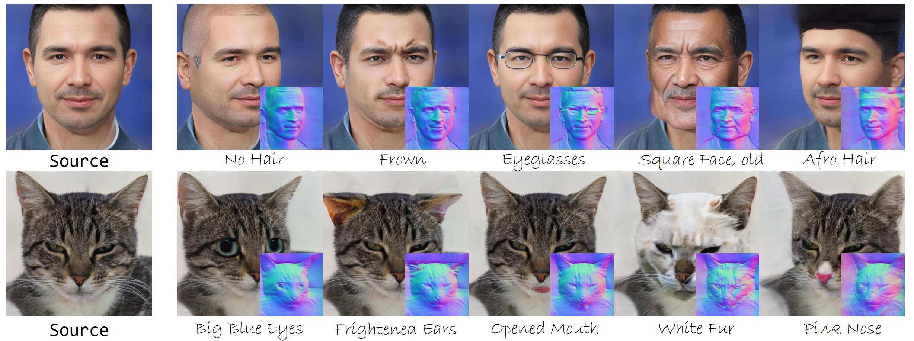

# MaTe3D
MaTe3D: Mask-guided Text-based 3D-aware Portrait Editing

[Kangneng Zhou](https://montaellis.github.io/), [Daiheng Gao](https://tomguluson92.github.io/), [Xuan Wang](https://xuanwangvc.github.io/), [Jie Zhang](https://scholar.google.com/citations?user=gBkYZeMAAAAJ), [Peng Zhang](https://scholar.google.com/citations?user=QTgxKmkAAAAJ&hl=zh-CN), [Xusen Sun](https://dblp.org/pid/308/0824.html), [Longhao Zhang](https://scholar.google.com/citations?user=qkJD6c0AAAAJ), [Shiqi Yang](https://www.shiqiyang.xyz/), [Bang Zhang](https://dblp.org/pid/11/4046.html), [Liefeng Bo](https://scholar.google.com/citations?user=FJwtMf0AAAAJ&hl=zh-CN), [Yaxing Wang](https://scholar.google.es/citations?user=6CsB8k0AAAAJ)

<a href='https://humanaigc.github.io/mate3d/'></a> <a href='https://arxiv.org/abs/2312.06947'></a> [](https://www.youtube.com/watch?v=6R5MXhz14R8)



## Citation	

```
@article{zhou2023mate3d,
  title     = {MaTe3D: Mask-guided Text-based 3D-aware Portrait Editing},
  author    = {Kangneng Zhou, Daiheng Gao, Xuan Wang, Jie Zhang, Peng Zhang, Xusen Sun, Longhao Zhang, Shiqi Yang, Bang Zhang, Liefeng Bo, Yaxing Wang},
  journal   = {arXiv preprint arXiv:2312.06947},
  website   = {https://humanaigc.github.io/mate3d/},
  year      = {2023}}
```
